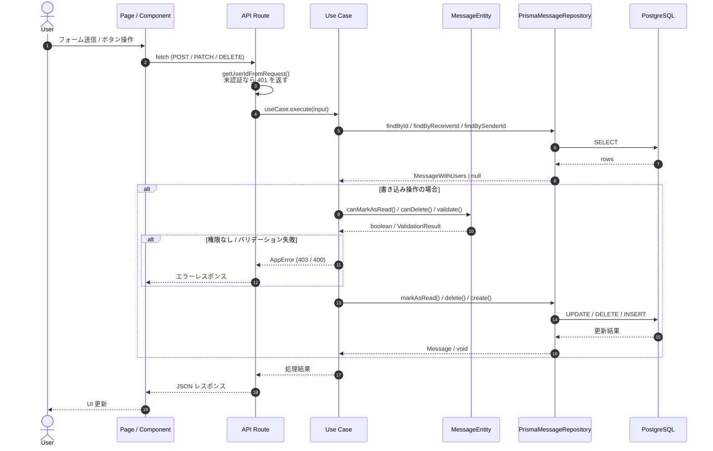

```mermaid
sequenceDiagram
    autonumber
    actor User
    participant Page as Page / Component
    participant API as API Route
    participant UC as Use Case
    participant Domain as MessageEntity
    participant Repo as PrismaMessageRepository
    participant DB as PostgreSQL

    User->>Page: フォーム送信 / ボタン操作
    Page->>API: fetch (POST / PATCH / DELETE)

    API->>API: getUserIdFromRequest()<br>未認証なら 401 を返す

    API->>UC: useCase.execute(input)

    UC->>Repo: findById / findByReceiverId / findBySenderId
    Repo->>DB: SELECT
    DB-->>Repo: rows
    Repo-->>UC: MessageWithUsers | null

    alt 書き込み操作の場合
        UC->>Domain: canMarkAsRead() / canDelete() / validate()
        Domain-->>UC: boolean / ValidationResult

        alt 権限なし / バリデーション失敗
            UC-->>API: AppError (403 / 400)
            API-->>Page: エラーレスポンス
        end

        UC->>Repo: markAsRead() / delete() / create()
        Repo->>DB: UPDATE / DELETE / INSERT
        DB-->>Repo: 更新結果
        Repo-->>UC: Message / void
    end

    UC-->>API: 処理結果
    API-->>Page: JSON レスポンス
    Page-->>User: UI 更新
```
